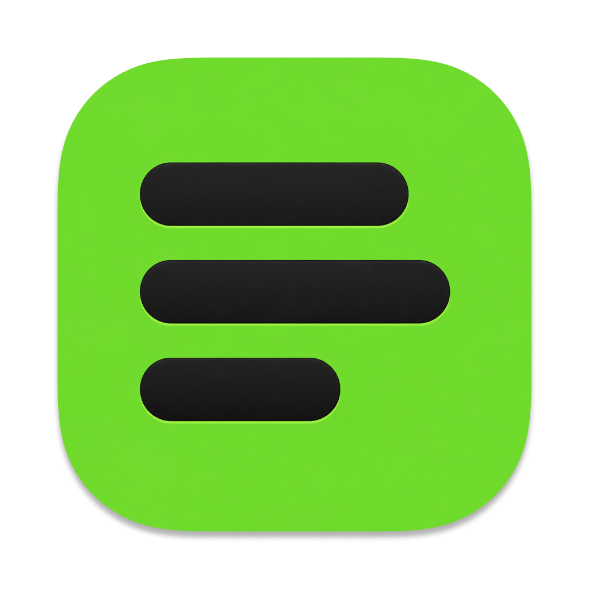

# QuotaBar for Windows

**Every AI coding limit, at a glance — in the system tray.**

[macOS version](https://github.com/QuotaBar/QuotaBar) ·
[Website](https://quota.bar)

**English** · [简体中文](README.zh-CN.md)

## Status

In development, not released yet. The version you can use today is
[QuotaBar for macOS](https://github.com/QuotaBar/QuotaBar/releases/latest).

## What it will do

QuotaBar shows how much of each AI coding service's quota you have used, when
each window resets, and roughly what it has cost — Claude, Codex, Gemini,
Cursor, Grok and more. Everything is read and worked out on your own computer.
No account, no telemetry.

## Relation to the macOS version

This is a separate codebase built with native Windows technology. Provider
reading and parsing follow the macOS version's
[`Sources/QuotaCore`](https://github.com/QuotaBar/QuotaBar/tree/main/Sources/QuotaCore)
as the reference implementation, and Quota Run follows the wire contract in
[`docs/quota-run.md`](https://github.com/QuotaBar/QuotaBar/blob/main/docs/quota-run.md).

## License

[MIT](LICENSE)
